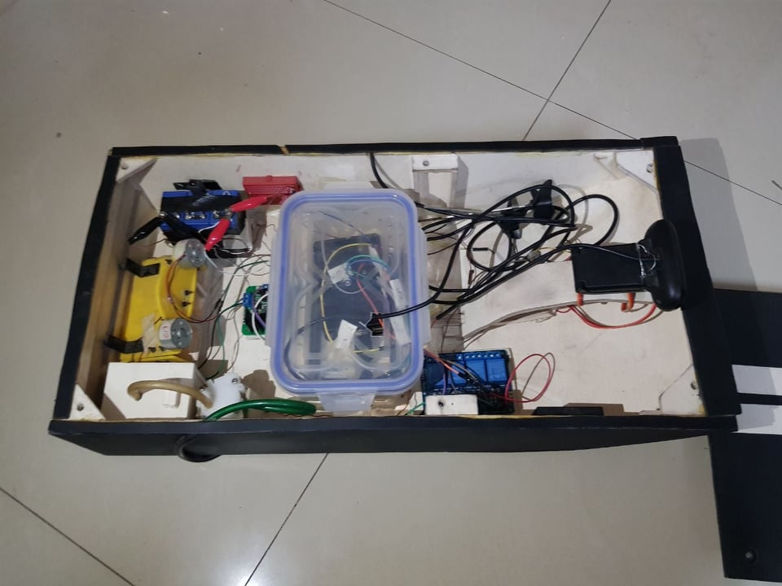

# WaterStrider

This is a project done by me and Manan Moin Shuddho as a part of the course titled Computer Interfacing, in BRAC University. It is
basically a hardware project where we tried to model a water-body monitoring robot, which we call the Water Strider. The Water Strider is 
controlled by an Android application and the commands sent by the application are received by a Raspberry PI attached within the robot, 
which enables mobility of its motors and uses sensors to send information back to the Android application. We successfully managed to
implement the control system that enables the mobility of the Water Strider. However, the feedback system is something that we have not
successfully implemented as of yet and is something that needs to be worked on.

The pictures of the hardware setup during testing as well as during BRAC University's hardware showcasing are given below. The name of our group was CSE360_Poseidon:

